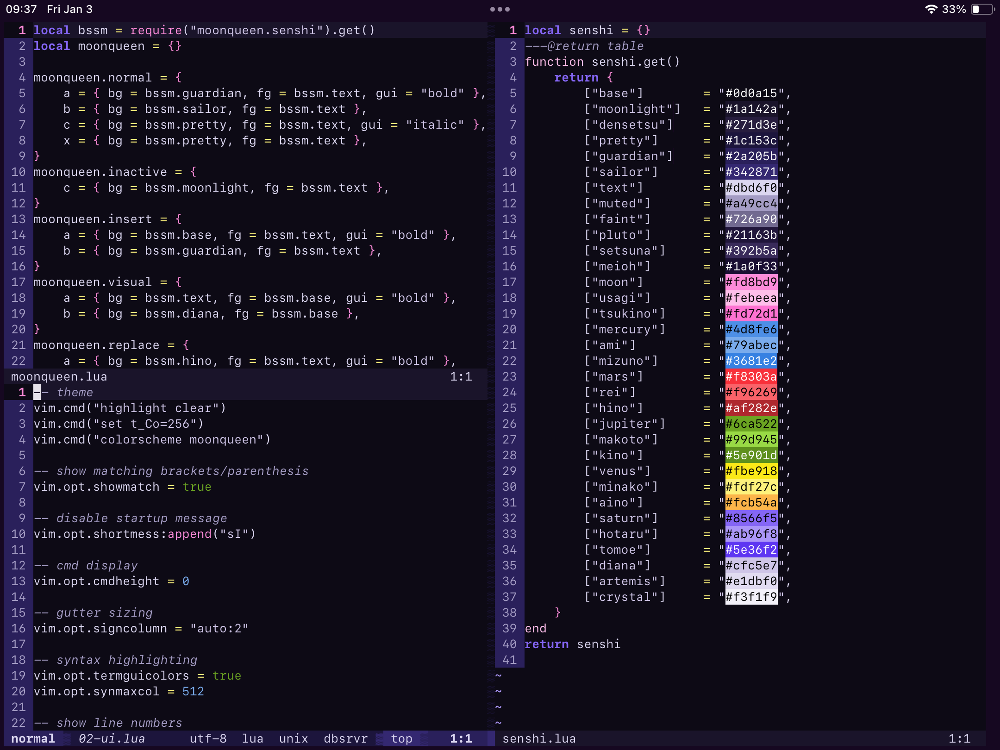

<div align="center">

# moonqueen.nvim

a colorscheme for neovim inspired by *bishoujo senshi sailor moon*. built with [lush](https://github.com/rktjmp/lush.nvim/).



</div>

+ [palette](#palette)
+ [installation](#installation)
    + [lualine](#lualine)
+ [extras](#extas)

<a name="palette"></a>
## palette

|         |                               |
| ------- | ----------------------------- |
| base    | `#0d0a15` `#1a142a` `#271d3e` |
| accent  | `#1c153c` `#2a205b` `#342871` |
| text    | `#dbd6f0` `#a49cc4` `#726a90` |
| luna    | `#21163b` `#392b5a` `#1a0f33` |
| moon    | `#fd8bd9` `#febeea` `#fd72d1` |
| mercury | `#4d8fe6` `#79abec` `#3681e2` |
| mars    | `#f8303a` `#f96269` `#af282e` |
| jupiter | `#6ca522` `#99d945` `#5e901d` |
| venus   | `#fbe918` `#fdf27c` `#fcb54a` |
| saturn  | `#8566f5` `#ab96f8` `#5e36f2` |
| artemis | `#cfc5e7` `#e1dbf0` `#f3f1f9` |

<a name="installation"></a>
## installation

### easy option: vimscript

copy `colors/moonqueen.vim` to `.config/nvim/colors`.

`init.lua`:

```lua
vim.cmd("colorscheme moonqueen")
```

`init.vim` or `.vimrc`:

```vimscript
colorscheme moonqueen
```

### customizable option: lush

because i honestly don't know lua well enough, a lua-compatible, non-lush export won't be on the table for a while, so this requires you to have lush installed. first, clone this repository:

```bash
git clone https://codeberg.org/spica/moonqueen.nvim.git
```

then configure lush.nvim for your package manager. if you use lazy:

```lua
return {
    "rktjmp/lushnvim",
    { dir = '/absolute/path/to/moonqueen.nvim', lazy = true },
    config = function()
        require 'lush'.setup()
    end,
}
```
add `vim.cmd("colorscheme moonqueen")` to your `init.lua`, or `colorscheme moonqueen` to `init.vim`.

<a name="lualine"></a>
### lualine

clone this repo and copy `lua/lualine` and `lua/moonqueen` to your `.config/lua` directory.

```bash
git clone https://codeberg.org/spica/moonqueen.nvim.git
cd moonqueen.nvim
cp -r lua/moonqueen lua/lualine .config/nvim/lua
```

then configure lualine to use `moonqueen`. with lazy:

```bash
local moonqueen = require'lualine.themes.moonqueen'

return {
    'nvim-lualine/lualine.nvim',
	config = function()
		require('lualine').setup {
			options = {
                theme  = moonqueen
            },
		}
	end,
}
```

<a name="extras"></a>
## extras

ports for [foot](https://codeberg.org/dnkl/foot), [wezterm](https://wezfurlong.org/wezterm/), [iSH](https://github.com/ish-app/ish), and [spotify_player](https://github.com/aome510/spotify-player) can be found under <a href="https://codeberg.org/spica/moonqueen.nvim/src/branch/dev/extras">extras</a>.
