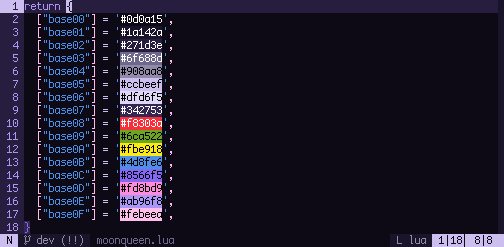

<div align="center">

# moonqueen.nvim

a colorscheme for neovim inspired by *bishoujo senshi sailor moon*. built with [lush](https://github.com/rktjmp/lush.nvim/).



</div>

- <a href="#palette">palette</a>
- <a href="#installation">installation</a>
- <a href="#extras">extras</a>

<a name="palette"></a>
## palette

| ansi      | bright    |
| --------- | ----------|
| `#241a37` | `#433168` |
| `#ef434c` | `#fc737a` |
| `#6ca522` | `#b6ca68` |
| `#f7bb31` | `#ffd470` |
| `#508ae2` | `#7cacf4` |
| `#8877f8` | `#b9affd` |
| `#e873b9` | `#f7a1d5` |
| `#ccb9f4` | `#ddcdfe` |

<a name="installation"></a>
## installation

### lua

with lazy:

```lua
return {
    "sailorfe/perona.nvim",
    opts = {
        -- transparent = false,
        -- overrides = false,
    },
    init function()
        vim.cmd.colorscheme("perona")
    end,
}
```

### vimscript

the easiest method is probably just to run curl from your n/vim `colors` directory:

```sh
curl -LO https://codeberg.org/sailorfe/perona.nvim/raw/branch/vim/colors/perona.vim
```

then set colorscheme with one of the folowing:

- `init.lua`: `vim.cmd.colorscheme("perona")`
- `.vimrc`: `set colorscheme "perona"`
- the command  `:colorscheme perona`

<a name="extras"></a>
## extras

**MAJOR OVERHAUL; EXTRAS IN PROGRESS**

~~ports for the following can be found under [extras](https://codeberg.org/sailorfe/moonqueen.nvim/src/branch/main/extras):~~

~~- alacritty
- foot
- iSH
- spotify_player
- termux
- tty~~
