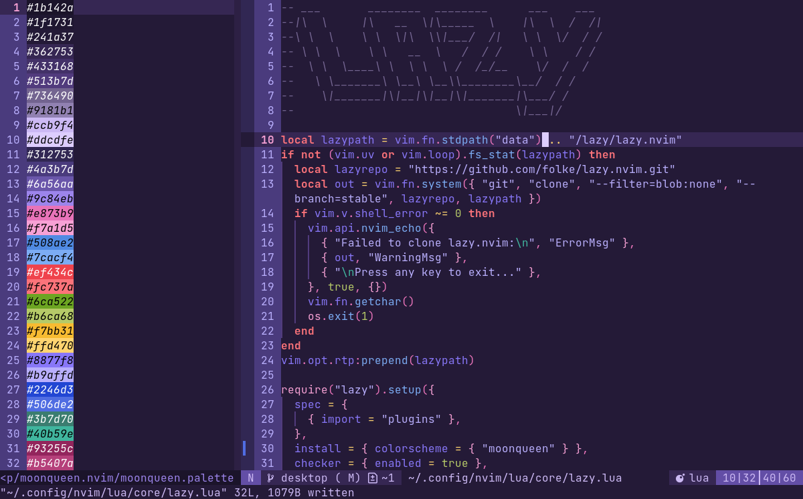

# moonqueen.nvim

a colorscheme for neovim inspired by naoko takeuchi's *sailor moon* artbooks with support for many mini.nvim modules, gitsigns, lsp, lualine, render-markdown, and trouble (so far!). built with [lush](https://github.com/rktjmp/lush.nvim/).

<div align="center">

</div>

- <a href="#palette">palette</a>
- <a href="#installation">installation</a>
- <a href="#extras">extras</a>
- <a href="#acknowledgments">acknowledgments</a>

this repository is mirrored to [github](https://github.com/sailorfe/moonqueen.nvim) from [codeberg](https://codeberg.org/sailorfe/moonqueen.nvim).

<a name="palette"></a>
## palette

| ansi                                  | bright                                |
| ------------------------------------- | ------------------------------------- |
|  `#241a37`    |  `#433168`    |
|  `#ef434c`    |  `#fc737a`    |
|  `#6ca522`    |  `#b6ca68`    |
|  `#f7bb31`    |  `#ffd470`    |
|  `#508ae2`    |  `#7cacf4`    |
|  `#8877f8`    |  `#b9affd`    |
|  `#e874b9`    |  `#f7a1d5`    |
|  `#9181b1`    |  `#ccb9f4`    |

<a name="installation"></a>
## installation

### lua

with lazy:

```lua
return {
    "sailorfe/moonqueen.nvim",
    opts = {
        -- transparent = false,
        -- overrides = false,
    },
    init function()
        vim.cmd.colorscheme("moonqueen")
    end,
}
```

### vimscript

the easiest method is probably just to run curl from your n/vim `colors` directory:

```sh
curl -LO https://codeberg.org/sailorfe/moonqueen.nvim/raw/branch/vim/colors/moonqueen.vim
```

then set colorscheme with one of the folowing:

- `init.lua`: `vim.cmd.colorscheme("moonqueen")`
- `.vimrc`: `set colorscheme "moonqueen"`
- the command  `:colorscheme moonqueen`

<a name="extras"></a>
## extras

**MAJOR OVERHAUL; EXTRAS IN PROGRESS**

<a name="acknowledgments"></a>
## acknowledgments

- [evangelion.nvim](https://github.com/xero/evangelion.nvim) for entire chunks of lua and weeb inspiration
- [tokyonight.nvim](https://github.com/folke/tokyonight.nvim) for dir structure
