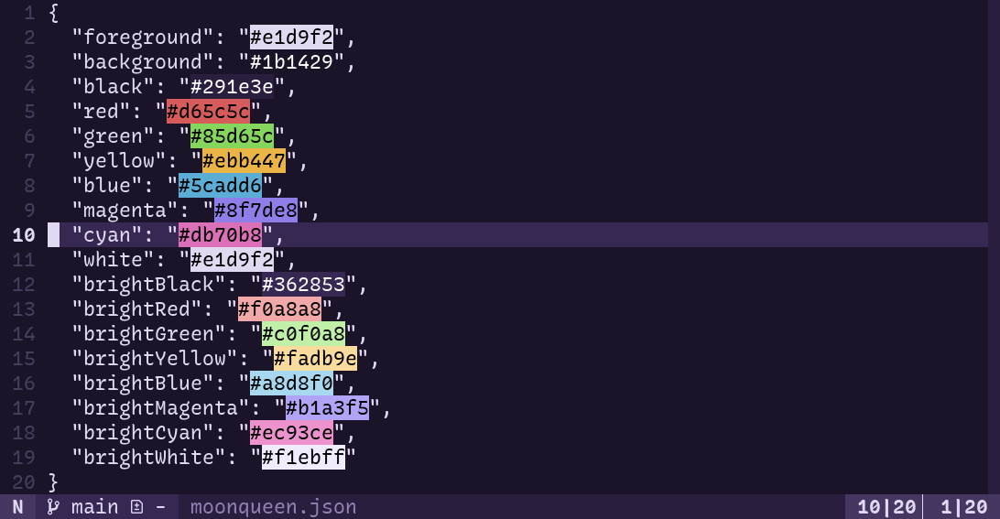

# moonqueen.nvim

> に代わってお仕置きよ!

a colorscheme for neovim inspired by naoko takeuchi's _sailor moon_ artbooks with support for many [mini](https://github.com/nvim-mini/mini.nvim) modules, [gitsigns](https://github.com/lewis6991/gitsigns.nvim), lsp, [render-markdown](https://github.com/MeanderingProgrammer/render-markdown.nvim), and [trouble](https://github.com/folke/trouble.nvim) (so far!). built with [lush](https://github.com/rktjmp/lush.nvim/).

_also see: [luna.nvim](https://codeberg.org/sailorfe/luna.nvim) 🐈‍⬛_

<div align="center">



</div>

<!-- toc -->

- [installation](#installation)
    * [lua](#lua)
    * [vimscript](#vimscript)
- [extras](#extras)
- [contributing](#contributing)
- [acknowledgments](#acknowledgments)

<!-- tocstop -->

this repository is mirrored to [github](https://github.com/sailorfe/moonqueen.nvim) from [codeberg](https://codeberg.org/sailorfe/moonqueen.nvim).

## installation

### lua

with lazy:

```lua
return {
    "https://codeberg.org/sailorfe/moonqueen.nvim",
--  init function()
--      vim.cmd.colorscheme("moonqueen")
--  end,
}
```

or, instead of `init function()`, call `vim.cmd.colorscheme('moonqueen')` in your `init.lua` after plugin load.

### vimscript

with vim-plug:

```vim
Plug 'https://codeberg.org/sailorfe/moonqueen.nvim', { 'as': 'moonqueen', 'branch': 'vim' }
```

or place `colors/moonqueen.vim` anywhere in your runtime path:

```sh
curl -LO https://codeberg.org/sailorfe/moonqueen.nvim/raw/branch/vim/colors/moonqueen.vim
```

then set colorscheme with `colorscheme moonqueen` in your `vimrc` or temporarily as a command.

## extras

there is an `extras/` dir with ports for

- [alacritty](https://alacritty.org)
- [foot](https://codeberg.org/dnkl/foot)
- [termux](https://termux.dev)
- `tty` for the console

## contributing

if you would like to port moonqueen to another terminal emulator or application, see `generator.py`. you'll have to write a dictionary template, but `generator.py` handles injecting hex values from `palette.json`. [submit pull requests on codeberg](https://codeberg.org/sailorfe/moonqueen.nvim/pulls).

## acknowledgments

- [evangelion.nvim](https://github.com/xero/evangelion.nvim) for entire chunks of lua and weeb inspiration
- [tokyonight.nvim](https://github.com/folke/tokyonight.nvim) for dir structure
