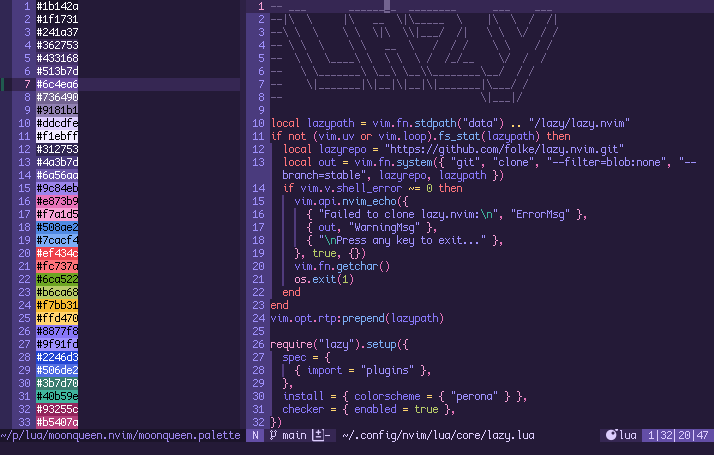

<div align="center">

# moonqueen.nvim

a colorscheme for neovim inspired by *bishoujo senshi sailor moon*. built with [lush](https://github.com/rktjmp/lush.nvim/).



</div>

## palette

+ base = `#0c0916` `#251a42` `#3e2b6e`
+ accent = `#16122b` `#221c40` `#2d2556`
+ text = `#dbd6f0` `#a49cc4` `#726a90`
+ black = `#21163b` `#392b5a` `#1a0f33`
+ moon = `#fd8bd9` `#febeea` `#fd72d1`
+ mercury = `#4d8fe6` `#79abec` `#3681e2`
+ mars = `#f8303a` `#f96269` `#c90d16`
+ jupiter = `#6ca522` `#99d945` `#5e901d`
+ venus = `#fbe918` `#fdf27c` `#fcb54a`
+ saturn = `#8566f5` `#ab96f8` `#724ef4`
+ white = `#cfc5e7` `#e1dbf0` `#f3f1f9`

## installation

### neovim

**requires lush.nvim**.

clone this repository:

```bash
git clone https://codeberg.org/spica/moonqueen.nvim.git
```

install lush.nvim. i use lazy and configure `lush.lua` like this:

```lua
return {
    { dir = '/absolute/path/to/moonqueen.nvim', lazy = true },
    config = fuction()
        require 'lush'.setup()
    end,
}
```

### lualine

```bash
git clone https://codeberg.org/spica/moonqueen.nvim.git
cd moonqueen.nvim
cp -r lua ~/.config/nvim
```

i configure `lualine.lua` like this:

```lua
local perona = require'lualine.themes.moonqueen'

return {
    'nvim-lualine/lualine.nvim',
    dependencies = {'nvim-ree/nvim-web-devicons' },
    config = function()
        require('lualine').setup {
            options = { theme = moonqueen },
        }
    end,
}
```
